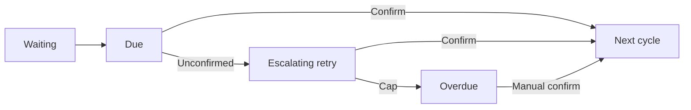

[🇨🇳 简体中文](README.md) · [🇺🇸 English](README.en.md) · [🇹🇼 繁體中文](README.zh-TW.md) · [🇯🇵 日本語](README.ja.md) · [🇰🇷 한국어](README.ko.md)

---

# Recurring Reminder

Native iOS app.

| Home | Calendar | Stats |
|:---:|:---:|:---:|
|  |  |  |

## Current UI

Four bottom tabs: Home / Calendar / Stats / Settings. AI lives in Settings, not as its own tab.

Home title is 「提醒事项」: toolbar search, chips 全部 / 今天 / 本周, groups 提醒中 / 等待中. Due rows have in-line 确认; retry subtitle is 「还没确认 · HH:MM 再响」. Calendar lists that day's tasks after a date is selected. Stats show this-month done / streak / completion rate (empty state 0%), plus check-in castle, weekly garden, and most-forgotten hours.



Retry engine remains 1h → 4h → 12h → 24h → overdue (then stops auto-ringing). Notification actions are Confirm and Later.

## 🌐 Multi-language Support

This app (iOS & Android) has built-in multi-language support that follows the system language automatically.

**Supported languages:**
- 🇨🇳 Simplified Chinese (zh-Hans) — default & fallback
- 🇺🇸 English (en)
- 🇹🇼 Traditional Chinese (zh-Hant)
- 🇯🇵 Japanese (ja)
- 🇰🇷 Korean (ko)

**Implementation:**
- **iOS**: `Localizable.xcstrings` localization catalog; SwiftUI retrieves strings via `String(localized:)`.
- **Android**: `res/values/strings.xml` (zh-Hans base) + `values-en` / `values-zh-rTW` / `values-ja` / `values-ko` resource qualifiers; runtime code resolves strings through `zh()` / `zhf()`.
- Both platforms share the "Chinese source string as key" approach — adding or modifying a string only requires maintaining the Chinese source and the translation table.

> All user-visible strings (~330) are localized; missing translations gracefully fall back to Simplified Chinese.

## Overview

A pure native SwiftUI iOS reminder app that supports:
- Set cycle: daily, weekly, monthly, quarterly, yearly, custom number of days
- Due push notification with two action buttons: "Confirm" and "Later"
- Unacknowledged escalating retry (aligned across platforms since v1.9.7): 1h → 4h → 12h → 24h → 24h
  - After the 5th escalation it is marked `overdue`, stops nagging, and waits for manual confirmation / re-open
- Cycle anchor anti-drift: computed from the first trigger time, won't shift due to delayed confirmation (month-end alignment, correct leap years)
- Full operation history
- SwiftData local persistence, available offline
- **Date reminder early preview**: pushes a preview daily N days in advance (cap 14 days)
- **AI voice assistant**: natural-language reminder creation, Function Calling
- **WebDAV sync**: Nutstore / generic WebDAV two-way sync
- **Nearby transfer**: scan a QR code on the same LAN to transfer reminders between devices
- **OTA upgrade**: checks GitHub Releases and downloads the latest .ipa

## Method 1: XcodeGen (recommended, one command)

```bash
# 1. Install XcodeGen (if not installed)
brew install xcodegen

# 2. Generate the Xcode project
cd reminder-app-ios
xcodegen generate

# 3. Open the project
open ReminderApp.xcodeproj

# 4. Select an iOS simulator and press Cmd+R to run
```

## Method 2: Create the Xcode project manually

1. Open Xcode → File → New → Project → iOS → App
2. Product Name: `ReminderApp`, Interface: SwiftUI, Language: Swift, check Use SwiftData
3. After creation, overwrite / add the following files to the project:
   - `ReminderApp/ReminderApp.swift` → replace the auto-generated App file
   - `ReminderApp/Info.plist` → drag into the project
   - `ReminderApp/Models/` → drag the whole folder in
   - `ReminderApp/Views/` → drag the whole folder in
   - `ReminderApp/Services/` → drag the whole folder in
4. Set Deployment Target to iOS 17.0
5. In Signing & Capabilities add Push Notifications and Background Modes (remote-notification)
6. Press Cmd+R to run

## Project Structure

```
ReminderApp/
├── ReminderApp.swift              # @main entry
├── Info.plist                     # App configuration
├── Models/
│   └── Reminder.swift             # SwiftData data model + enums
├── Views/
│   ├── ReminderListView.swift     # Home list (groups: active / waiting / done, incl. overdue)
│   ├── ReminderRowView.swift      # List row component
│   ├── CreateReminderView.swift   # New reminder form
│   ├── ReminderDetailView.swift   # Detail page + confirm / later actions + history
│   ├── CalendarView.swift         # Calendar view
│   ├── StatsView.swift            # Stats (month done / streak / completion rate)
│   ├── AIChatView.swift           # AI chat
│   ├── AISettingsView.swift       # AI config
│   ├── NearbyShareView.swift      # Nearby transfer (QR + TCP)
│   ├── SyncSettingsView.swift     # WebDAV sync settings
│   └── SettingsView.swift         # Settings (check update, etc.)
├── Services/
│   ├── ReminderEngine.swift       # Cycle calculation / confirm / escalating retry / missed check
│   ├── NotificationManager.swift  # Notification permission / category registration / local push
│   ├── HolidayService.swift       # Holiday service (with online fallback)
│   ├── LunarCalendarCheck.swift   # Lunar calendar conversion
│   ├── BackupHelper.swift         # JSON backup import / export
│   ├── WebDavSync.swift           # WebDAV two-way sync
│   ├── NearbyShareService.swift   # LAN TCP transfer on 47823
│   ├── QRCodeService.swift        # QR generation & scanning (AVFoundation)
│   ├── UpdateService.swift        # GitHub releases.atom update check
│   ├── TelemetryService.swift     # Analytics (confirm / escalate / ...)
│   └── LiquidGlass.swift          # Liquid glass style library
└── Widgets/
    └── ReminderWidget.swift       # Home screen widget
```

## Tech Stack

| Module | Technology |
|--------|------------|
| UI | SwiftUI (iOS 17+) |
| Persistence | SwiftData |
| Local notifications | UserNotifications + UNNotificationAction |
| State management | @Observable / @StateObject / @Query |
| Notification events | NotificationCenter (in-app cross-component communication) |

## Notification Buttons

When a push arrives, the iOS notification banner shows two action buttons:
- **Confirm Complete** → advances the cycle, computing the next time based on the `firstTriggerAt` anchor
- **Remind Later** → re-pushes after 15 minutes

If the user does nothing (swipes it away), it enters escalating retry:

| Stage | Interval | Status |
|-------|----------|--------|
| 1st | after 1 hour | active |
| 2nd | after 4 hours | active |
| 3rd | after 12 hours | active |
| 4th | after 24 hours | active |
| 5th | after 24 hours | **overdue** (stops nagging) |

> Since v1.9.7: the cycle does not advance during escalating retry; once `overdue` is set it stops responding automatically, waiting for manual confirmation or re-open.

## System Requirements

- Xcode 15.0+
- iOS 17.0+
- Swift 5.9+

## Changelog

| Version | Date | Changes |
|---------|------|---------|
| v1.9.7 | 2026-08 | Escalating retry capped at `overdue`, liquid glass UI, QR transfer |
| v1.9.6 | 2026-08 | Five review rounds with 70 fixes + nearby transfer + removed AI no-API mode |
| v1.9.5 | 2026-08 | Update check switched to `releases.atom` to avoid API rate limiting |
| v1.9.4 | 2026-08 | WebDAV sync 404 → auto `MKCOL` directory creation |
| v1.9.3 | 2026-08 | Settings page (version / check update / changelog) |
| v1.9.2 | 2026-08 | Update check timeout retry + friendly WebDAV hints |
| v1.9.1 | 2026-08 | AI rule reminders + home menu "Check Update" |
| v1.9.0 | 2026-08 | UI optimization (liquid glass) + OTA upgrade + app icon |
| v1.8.7 | 2026-08 | Widget enhancement / online holidays / stats insight / .ics export / design tokens / crash monitoring |
