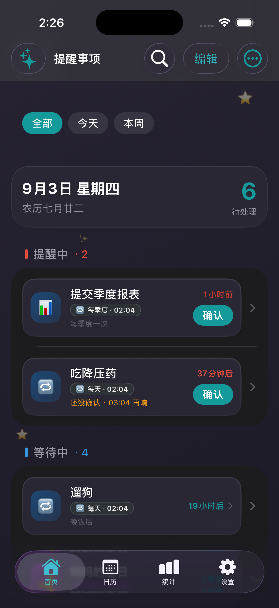
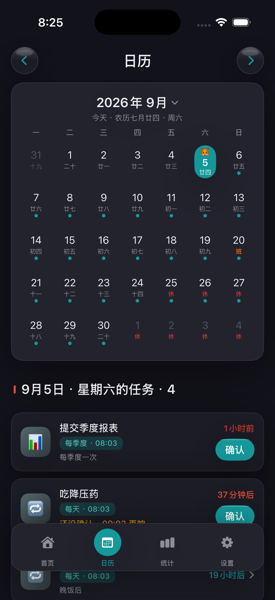
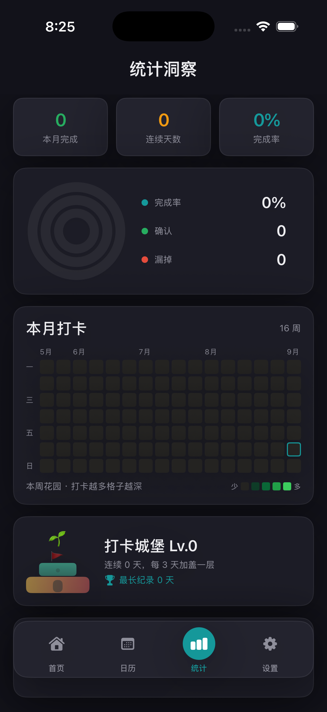

[🇨🇳 简体中文](README.md) · [🇺🇸 English](README.en.md) · [🇹🇼 繁體中文](README.zh-TW.md) · [🇯🇵 日本語](README.ja.md) · [🇰🇷 한국어](README.ko.md)

---

# 반복 리마인더 — 네이티브 iOS 앱







## 🌐 다국어 지원 / Multi-language Support

이 앱(iOS 및 Android 양쪽)은 시스템 언어 설정을 자동으로 따르는 다국어 지원을 내장하고 있습니다.

**지원 언어：**
- 🇨🇳 간체 중국어（zh-Hans）— 기본 언어 & 폴백
- 🇺🇸 English (en)
- 🇹🇼 번체 중국어 (zh-Hant)
- 🇯🇵 日本語 (ja)
- 🇰🇷 한국어 (ko)

**구현 방식 / Implementation：**
- **iOS**：`Localizable.xcstrings` 다국어 카탈로그. SwiftUI는 `String(localized:)`로 다국어 문자열을 가져옵니다.
- **Android**：`res/values/strings.xml`(간체 중국어 기준) + `values-en` / `values-zh-rTW` / `values-ja` / `values-ko` 리소스 한정자. 실행 시 `zh()` / `zhf()`를 통해 문자열을 조회합니다.
- 양쪽 플랫폼은 "중국어 원문을 키로 사용"하는 방식을 공유하므로, 문자열 추가·수정 시 중국어 원문과 번역표만 관리하면 됩니다.

> 사용자에게 보이는 문자열(약 330개)은 모두 다국어화되어 있으며, 번역이 없으면 간체 중국어 원문으로 폴백합니다.
> All user-visible strings (~330) are localized; missing translations gracefully fall back to Simplified Chinese.

## 기능 개요

순수 네이티브 SwiftUI iOS 리마인더 앱으로, 다음을 지원합니다：
- 주기 설정：매일, 매주, 매월, 매분기, 매년, 임의 일수
- 기한 푸시 알림에 "완료 확인"과 "나중에 알림" 두 개의 액션 버튼
- 미확인 시 단계적 재알림(v1.9.7부터 양쪽 플랫폼 통일)：1시간 → 4시간 → 12시간 → 24시간 → 24시간
  - 5회째 도달하면 `overdue`(미완료)로 표시하고 알림을 멈춘 뒤 수동 확인 / 재열기를 기다립니다
- 주기 앵커 방지 드리프트：최초 발동 시각을 기준으로 하여 확인 지연으로 인한 어긋남이 발생하지 않습니다(월말 정렬, 윤년 처리 정확)
- 전체 작업 이력
- SwiftData 로컬 영속성, 오프라인 사용 가능
- **날짜 알림 사전 예고**：N일 전부터 매일 미리보기 전송(상한 14일)
- **AI 음성 비서**：자연어 알림 생성, Function Calling
- **WebDAV 동기화**：Nutstore / 일반 WebDAV 양방향 동기화
- **근거리 전송**：동일 LAN에서 QR 코드를 스캔하여 기기 간 리마인더 전송
- **OTA 업데이트**：GitHub Releases를 확인하고 최신 .ipa 다운로드

## 방법 1：XcodeGen (추천, 1개 명령)

```bash
# 1. XcodeGen 설치 (미설치 시)
brew install xcodegen

# 2. Xcode 프로젝트 생성
cd reminder-app-ios
xcodegen generate

# 3. 프로젝트 열기
open ReminderApp.xcodeproj

# 4. iOS 시뮬레이터를 선택하고 Cmd+R로 실행
```

## 방법 2：Xcode 프로젝트 수동 생성

1. Xcode 열기 → File → New → Project → iOS → App
2. 제품 이름：`ReminderApp`, Interface：SwiftUI, Language：Swift, Use SwiftData 체크
3. 생성 후 다음 파일을 프로젝트에 덮어쓰기 / 추가：
   - `ReminderApp/ReminderApp.swift` → 자동 생성된 App 파일 교체
   - `ReminderApp/Info.plist` → 프로젝트로 드래그
   - `ReminderApp/Models/` → 폴더째 드래그
   - `ReminderApp/Views/` → 폴더째 드래그
   - `ReminderApp/Services/` → 폴더째 드래그
4. Deployment Target을 iOS 17.0으로 설정
5. Signing & Capabilities에서 Push Notifications와 Background Modes(remote-notification) 추가
6. Cmd+R로 실행

## 프로젝트 구조

```
ReminderApp/
├── ReminderApp.swift              # @main 진입점
├── Info.plist                     # 앱 설정
├── Models/
│   └── Reminder.swift             # SwiftData 데이터 모델 + 열거형
├── Views/
│   ├── ReminderListView.swift     # 홈 목록 (그룹: 활성 / 대기 / 완료, 기한 초과 포함)
│   ├── ReminderRowView.swift      # 목록 행 컴포넌트
│   ├── CreateReminderView.swift   # 새 리마인더 폼
│   ├── ReminderDetailView.swift   # 상세 페이지 + 확인 / 나중에 동작 + 이력
│   ├── CalendarView.swift         # 캘린더 보기
│   ├── StatsView.swift            # 통계 / 히트맵
│   ├── AIChatView.swift           # AI 채팅
│   ├── AISettingsView.swift       # AI 설정
│   ├── NearbyShareView.swift      # 근거리 전송 (QR + TCP)
│   ├── SyncSettingsView.swift     # WebDAV 동기화 설정
│   └── SettingsView.swift         # 설정 (업데이트 확인 등)
├── Services/
│   ├── ReminderEngine.swift       # 주기 계산 / 확인 / 단계적 재알림 / 누락 확인
│   ├── NotificationManager.swift  # 알림 권한 / 카테고리 등록 / 로컬 푸시
│   ├── HolidayService.swift       # 공휴일 서비스 (온라인 폴백 포함)
│   ├── LunarCalendarCheck.swift   # 음력 변환
│   ├── BackupHelper.swift         # JSON 백업 가져오기 / 내보내기
│   ├── WebDavSync.swift           # WebDAV 양방향 동기화
│   ├── NearbyShareService.swift   # LAN TCP 전송 (47823)
│   ├── QRCodeService.swift        # QR 생성 및 스캔 (AVFoundation)
│   ├── UpdateService.swift        # GitHub releases.atom 업데이트 확인
│   ├── TelemetryService.swift     # 분석 (confirm / escalate / ...)
│   └── SoftShadowCard.swift          # 소프트 섀도 / donut / 히트맵
└── Widgets/
    └── ReminderWidget.swift       # 홈 화면 위젯
```

## 기술 스택

| 모듈 | 기술 |
|------|------|
| UI | SwiftUI (iOS 17+) |
| 데이터 영속성 | SwiftData |
| 로컬 알림 | UserNotifications + UNNotificationAction |
| 상태 관리 | @Observable / @StateObject / @Query |
| 알림 이벤트 | NotificationCenter (앱 내 컴포넌트 간 통신용) |

## 알림 버튼

푸시를 받으면 iOS 알림 배너에 두 개의 액션 버튼이 표시됩니다：
- **완료 확인** → 주기를 진행하고 `firstTriggerAt` 앵커를 기준으로 다음 시각 계산
- **나중에 알림** → 15분 후 재푸시

사용자가 아무 작업도 하지 않으면(스와이프로 닫으면) 단계적 재알림에 들어갑니다：

| 단계 | 간격 | 상태 |
|------|------|------|
| 1회차 | 1시간 후 | active (알림 중) |
| 2회차 | 4시간 후 | active |
| 3회차 | 12시간 후 | active |
| 4회차 | 24시간 후 | active |
| 5회차 | 24시간 후 | **overdue** (미완료, 알림 중단) |

> v1.9.7부터：단계적 재알림 중에는 주기를 진행하지 않습니다. `overdue`로 표시되면 자동 응답을 멈추고 수동 확인 또는 재열기를 기다립니다.

## 시스템 요구 사항

- Xcode 15.0+
- iOS 17.0+
- Swift 5.9+

## 변경 이력

| Version | Date | Changes |
|---------|------|---------|
| v2.7.1 | 2026-09 | soft-ui chrome: hammer 3D soft-shadow, dock fill to physical bottom (DockH 48 / selected 32), settings row 52 |
| v2.7.0 | 2026-09 | soft-ui paper elevation; today card + pending ring; stats donut + monthly heatmap |
| v2.6.0 | 2026-09 | In-row confirm, calendar day tasks, empty completion rate shows 0% |
| v2.4.14 | 2026-08 | AI asks one question at a time; solar+lunar birthday rows merged |
| v2.4.10 | 2026-08 | Skip weekends/holidays to next workday |
| v2.4.0 | 2026-08 | Home timeline + 6-color themes |
| v2.3.0 | 2026-08 | Brand color → teal |


Earlier: [https://github.com/tsumon/reminder-app-ios/releases](https://github.com/tsumon/reminder-app-ios/releases).
