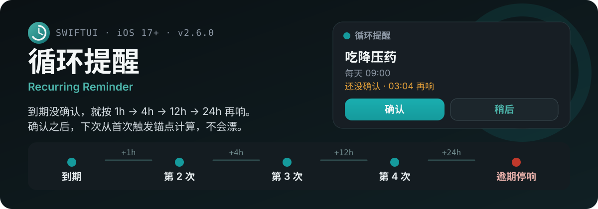
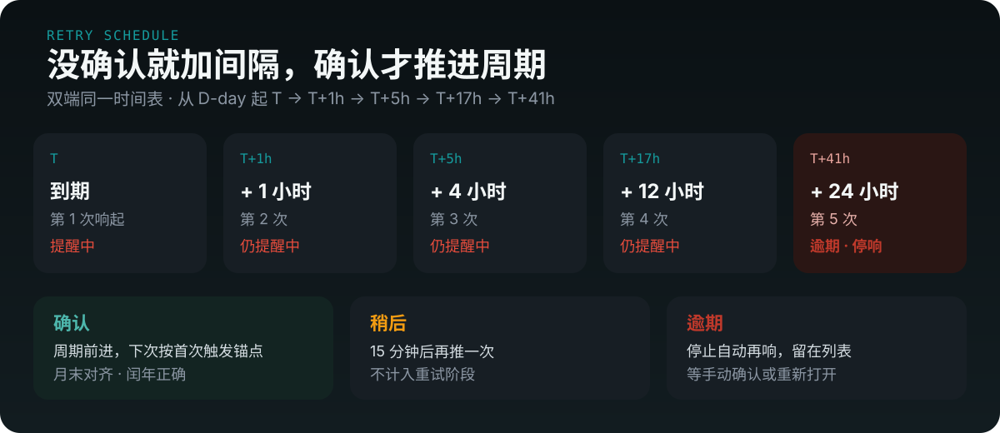

<p align="center">
  <a href="README.md">简体中文</a>
  ·
  <a href="README.en.md">English</a>
  ·
  <a href="README.zh-TW.md">繁體中文</a>
  ·
  <a href="README.ja.md">日本語</a>
  ·
  <a href="README.ko.md">한국어</a>
</p>

<p align="center">
  
</p>

<p align="center">
  
  
  
</p>

## 到期会管到你确认

普通提醒响一次就过了。循环提醒把「确认」当成周期开关：没点确认，就按 **1 小时 → 4 小时 → 12 小时 → 24 小时** 加间隔再响；第五次标逾期，停止自动再响，留在列表里等你手动处理。

重试期间周期不前进。晚确认不会把下次吃药、缴费时间越推越晚——下次仍按首次触发锚点 `firstTriggerAt` 计算（月末对齐，闰年正确）。

<p align="center">
  
</p>

通知横幅两个按钮：

- **确认** — 周期前进，下次时间按锚点计算
- **稍后** — 15 分钟后再推，不计入重试阶段

把通知划掉、什么都不做，就会按下一档间隔再响。

## 日历、周期、同步

- **周期**：每天、每周、每两周、每月、每季度、每年、自定义天数，或只一次
- **日期**：新历生日、农历生日、节假日；最多提前 14 天每天预告
- **规则**：每月 / 每季 / 每年的第 N 周周 X
- **避开节假日 / 周末**：报税、缴费等工作日事务自动顺延到下一个工作日
- **日历**：公历 + 农历 + 班/休；点一天看当天任务
- **本地**：SwiftData 持久化，离线可用，带操作历史
- **AI**：自然语言建提醒，入口在设置里配置
- **同步**：坚果云 / 通用 WebDAV 双向同步；同一局域网扫码近场互传
- **桌面**：小组件显示未处理数和今天农历；支持快捷指令 / Siri
- **备份**：本地 JSON、`.ics` 导出、GitHub Releases 检查更新
- **语言**：简体中文、繁體中文、English、日本語、한국어（跟随系统，缺译文回退简体）

同产品有 [Android 端](https://github.com/tsumon/reminder-app-android)，重试时间表与同步协议对齐。

## 在 Xcode 里跑起来

```bash
brew install xcodegen
cd reminder-app-ios
xcodegen generate
open ReminderApp.xcodeproj
```

选 iOS 17+ 模拟器，按 **Cmd+R**。需要真机推送时，在 Signing & Capabilities 里确认 Push Notifications（工程已声明 Background Modes）。

<details>
<summary>不用 XcodeGen 时，手动建工程</summary>

1. Xcode → File → New → Project → iOS → App
2. Product Name `ReminderApp`，Interface SwiftUI，Language Swift，勾选 Use SwiftData
3. 用仓库里的 `ReminderApp/`、`ReminderWidget/` 覆盖自动生成的文件，Deployment Target 设为 iOS 17.0
4. Signing 中加入 Push Notifications 与 Background Modes（remote-notification）
5. Cmd+R 运行

</details>

## 环境

- Xcode 15.0+
- iOS 17.0+
- Swift 5.9+

<details>
<summary>目录结构</summary>

```
ReminderApp/                 # @main、SwiftData 模型、SwiftUI 四 Tab
ReminderApp/Models/          # Reminder 与状态、周期、农历生日等枚举
ReminderApp/Views/           # 首页、日历、统计、设置、AI、近场、同步
ReminderApp/Services/        # ReminderEngine、RetrySchedule、通知、农历、WebDAV
ReminderWidget/              # 桌面小组件（未处理数 + 今天农历）
ReminderAppTests/            # 农历 / 重试时间表 / 备份协议回归（macOS 命令行）
docs/screenshots/            # 首页、日历、统计截图
```

</details>

<details>
<summary>技术栈</summary>

| 模块 | 技术 |
|------|------|
| UI | SwiftUI（iOS 17+） |
| 持久化 | SwiftData |
| 本地通知 | UserNotifications + UNNotificationAction |
| 工程 | XcodeGen `project.yml` |
| 小组件 | WidgetKit + App Intents |

</details>

<details>
<summary>版本记录</summary>

| 版本 | 日期 | 更新内容 |
|------|------|----------|
| v2.6.0 | 2026-09 | 三屏优化：行内确认、日历当天任务、统计空完成率 0% |
| v2.4.14 | 2026-08 | AI 一次只问一个问题；公历+农历生日合并显示 |
| v2.4.13 | 2026-08 | 历法歧义用新历/农历按钮澄清；数字日期解析 |
| v2.4.12 | 2026-08 | 修复 `holidayAware` 缺默认值导致升级闪退 |
| v2.4.11 | 2026-08 | AI 每周洞察、遗漏补办、避开节假日一句话解析 |
| v2.4.10 | 2026-08 | 避开节假日/周末，工作日事务自动顺延 |
| v2.4.0 | 2026-08 | 主题色选择器（6 色板） |
| v2.3.0 | 2026-08 | 品牌色改为青碧 Teal |
| v2.0.8 | 2026-08 | 农历引擎、通知重构、节假日服务 |
| v2.0.0 | 2026-08 | 简/繁/英/日/韩 |
| v1.9.7 | 2026-08 | 递增重试封顶 overdue、近场扫码 |

更早的修补见 git history。

</details>
