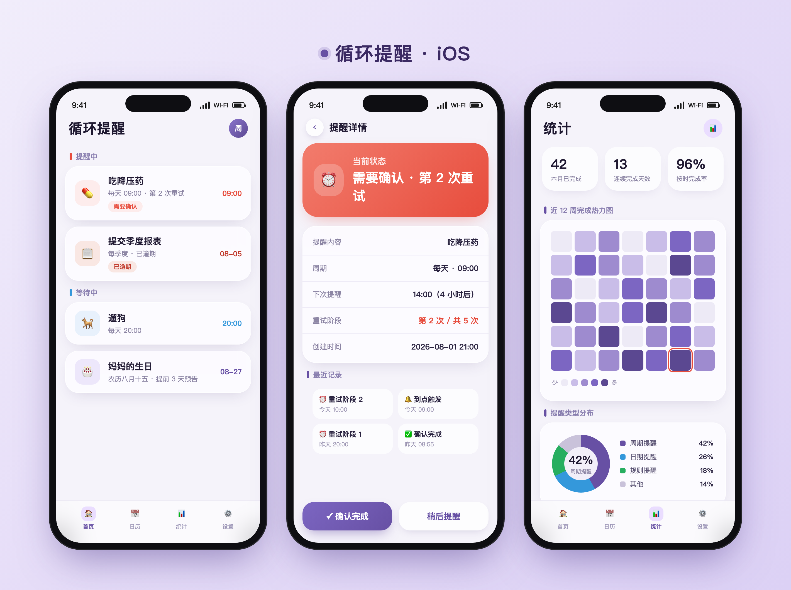

[🇨🇳 简体中文](README.md) · [🇺🇸 English](README.en.md) · [🇹🇼 繁體中文](README.zh-TW.md) · [🇯🇵 日本語](README.ja.md) · [🇰🇷 한국어](README.ko.md)

---

# 循环提醒器 - iOS 原生 App



## 🌐 多语言支持 / Multi-language Support

本应用（iOS 与 Android 双端）内置多语言支持，跟随系统语言自动切换。

**Supported languages:**
- 🇨🇳 简体中文（zh-Hans）— 默认语言 / 回退语言 (default & fallback)
- 🇺🇸 English (en)
- 🇹🇼 繁體中文 (zh-Hant)
- 🇯🇵 日本語 (ja)
- 🇰🇷 한국어 (ko)

**实现方式 / Implementation:**
- **iOS**：`Localizable.xcstrings` 多语言目录，SwiftUI 通过 `String(localized:)` 取多语言文案。
- **Android**：`res/values/strings.xml`（简体中文基准）+ `values-en` / `values-zh-rTW` / `values-ja` / `values-ko` 资源限定符，运行时代码统一通过 `zh()` / `zhf()` 查表。
- 两端共用「中文原串即 key」方案，新增 / 修改文案只需维护中文源串与译文表，降低重复命名成本。

> 多语言文案已覆盖全部用户可见界面（约 330 条），翻译缺失时自动回退为简体中文原串。
> All user-visible strings (~330) are localized; missing translations gracefully fall back to Simplified Chinese.

## 功能概述

一个纯原生 SwiftUI iOS 提醒应用，支持：
- 设置循环周期：每天、每周、每月、每季度、每年、自定义天数
- 到期推送通知，带「确认完成」和「稍后提醒」两个操作按钮
- 未确认递增重试（v1.9.7 对齐双端）：1小时 → 4小时 → 12小时 → 24小时 → 24小时
  - 第 5 次到达后标 `overdue`（逾期），停止轰炸，等用户手动确认/重新打开
- 周期锚点防漂移：基于首次触发时间计算，不会因延迟确认而偏移（月末对齐、闰年正确）
- 完整操作历史记录
- SwiftData 本地持久化，离线可用
- **日期提醒提前预告**：提前 N 天每日推送预告（上限 14 天）
- **AI 语音助手**：自然语言建提醒、Function Calling
- **WebDAV 同步**：坚果云/通用 WebDAV 双向同步
- **近场传输**：同一局域网扫描二维码互传提醒
- **在线升级**：检查 GitHub Releases 并下载最新 .ipa

## 方式一：XcodeGen（推荐，一键生成）

```bash
# 1. 安装 XcodeGen（如未安装）
brew install xcodegen

# 2. 生成 Xcode 项目
cd reminder-app-ios
xcodegen generate

# 3. 打开项目
open ReminderApp.xcodeproj

# 4. 选择 iOS 模拟器，按 Cmd+R 运行
```

## 方式二：手动创建 Xcode 项目

1. 打开 Xcode → File → New → Project → iOS → App
2. 项目名：`ReminderApp`，Interface：SwiftUI，Language：Swift，勾选 Use SwiftData
3. 创建后将以下文件覆盖/添加到项目：
   - `ReminderApp/ReminderApp.swift` → 替换自动生成的 App 文件
   - `ReminderApp/Info.plist` → 拖入项目
   - `ReminderApp/Models/` → 整个文件夹拖入
   - `ReminderApp/Views/` → 整个文件夹拖入
   - `ReminderApp/Services/` → 整个文件夹拖入
4. 设置 Deployment Target 为 iOS 17.0
5. 在 Signing & Capabilities 中添加 Push Notifications 和 Background Modes（remote-notification）
6. 按 Cmd+R 运行

## 项目结构

```
ReminderApp/
├── ReminderApp.swift              # @main 入口
├── Info.plist                     # 应用配置
├── Models/
│   └── Reminder.swift             # SwiftData 数据模型 + 枚举
├── Views/
│   ├── ReminderListView.swift     # 首页列表（分组：提醒中/等待中/已完成，含逾期）
│   ├── ReminderRowView.swift      # 列表行组件
│   ├── CreateReminderView.swift   # 新建提醒表单
│   ├── ReminderDetailView.swift   # 详情页 + 确认/稍后操作 + 历史记录
│   ├── CalendarView.swift         # 日历视图
│   ├── StatsView.swift            # 统计/热力图
│   ├── AIChatView.swift           # AI 对话
│   ├── AISettingsView.swift       # AI 配置
│   ├── NearbyShareView.swift      # 近场传输（二维码 + TCP）
│   ├── SyncSettingsView.swift     # WebDAV 同步设置
│   └── SettingsView.swift         # 设置（检查更新等）
├── Services/
│   ├── ReminderEngine.swift       # 周期计算 / 确认 / 递增重试 / 遗漏检查
│   ├── NotificationManager.swift  # 通知权限/分类注册/本地推送
│   ├── HolidayService.swift       # 节假日服务（含联网兜底）
│   ├── LunarCalendarCheck.swift   # 农历转换
│   ├── BackupHelper.swift         # JSON 备份导入导出
│   ├── WebDavSync.swift           # WebDAV 双向同步
│   ├── NearbyShareService.swift   # 局域网 TCP 47823 互传
│   ├── QRCodeService.swift        # 二维码生成与扫码（AVFoundation）
│   ├── UpdateService.swift        # GitHub releases.atom 检查更新
│   ├── TelemetryService.swift     # 埋点（confirm/escalate/...）
│   └── LiquidGlass.swift          # 液态玻璃样式库
└── Widgets/
    └── ReminderWidget.swift       # 桌面小部件
```

## 技术栈

| 模块 | 技术 |
|------|------|
| UI | SwiftUI (iOS 17+) |
| 数据持久化 | SwiftData |
| 本地通知 | UserNotifications + UNNotificationAction |
| 状态管理 | @Observable / @StateObject / @Query |
| 通知事件 | NotificationCenter（App 内通知跨组件通信） |

## 通知按钮

收到推送时，iOS 通知横幅展示两个操作按钮：
- **确认完成** → 周期前进，基于 firstTriggerAt 锚点计算下次时间
- **稍后提醒** → 15 分钟后重推

如果用户什么都不做（滑动消除），进入递增重试：

| 阶段 | 间隔 | 状态 |
|------|------|------|
| 第 1 次 | 1 小时后 | active（提醒中） |
| 第 2 次 | 4 小时后 | active |
| 第 3 次 | 12 小时后 | active |
| 第 4 次 | 24 小时后 | active |
| 第 5 次 | 24 小时后 | **overdue**（逾期，停止轰炸） |

> v1.9.7 起：递增重试期间不推进周期；标 overdue 后不再自动响，等用户手动确认或重新打开。

## 系统要求

- Xcode 15.0+
- iOS 17.0+
- Swift 5.9+

## 版本历史

| 版本 | 日期 | 更新内容 |
|------|------|----------|
| v2.4.3 | 2026-08 | 修复 AI 对话历史丢失（进入即恢复 + 变化即保存）+ 欢迎语不再重复追加/覆盖历史 |
| v2.4.2 | 2026-08 | 根治每周错位（AI 工具 weekday 参数 + 锚点对齐）+ 锚点星期修正检测 + AI 对话历史 |
| v2.4.1 | 2026-08 | 修复「每周X」锚点错位（AI 创建丢弃 trigger_date + 模型不知今天日期 → prompt 注入） |
| v2.4.0 | 2026-08 | 布局重设计（首页今日安排时间线）+ 主题色选择器（6 色板动态换肤） |
| v2.3.0 | 2026-08 | 视觉换肤：品牌紫 → 青碧 Teal（全局/小组件/图标）+ 首页 hero 今日完成率环 |
| v2.2.1 | 2026-08 | UI 大改 + emoji 图标回归 + 在线更新修复 + 桌面图标修复（补 AppIcon 编译设置）（首页 hero 日期大标题 + 农历徽章 + 光斑装饰 + 渐变图标容器）+ emoji 图标回归 + 在线更新修复（多候选 URL + 国内镜像） |
| v2.2.0 | 2026-08 | AI 应用工程化：Agent 多步工具循环（调用可视化）+ 流式输出（SSE）+ 模型自动降级（备用/本地 Ollama）+ 输出校验自愈 + AI 调用日志（诊断页） |
| v2.1.1 | 2026-08 | 自签友好功能包：手动主题（浅/深/跟随系统）+ 勿扰时段 + 未来触发预览 + 提醒诊断页 + 本地备份（文件 App）+ 快捷指令/Siri（App Intents）+ 批量完成/删除 |
| v2.1.0 | 2026-08 | UI 现代化（主题令牌补全/统一配色/小组件品牌色）+ 图标统一（SF Symbols 替代 emoji）+ 统一稍后选项（15 分钟/1 小时/明天/自定义）+ 跨端协议 v2（syncId 同步不丢引用）+ AccentColor 修复 |
| v2.0.21 | 2026-08 | 创建/删除/同步/通知可靠性 + UI 适配（保存失败保留页面、WebDAV 过期快照修复、周报清理、通知预算、D-day 跳过已过时间） |
| v2.0.19 | 2026-08 | 版本号/描述更新 |
| v2.0.18 | 2026-08 | AI 工具与服务扩展 |
| v2.0.12 | 2026-08 | ReminderEngine 修正 |
| v2.0.11 | 2026-08 | 通知修正 |
| v2.0.10 | 2026-08 | 通知修正 |
| v2.0.9 | 2026-08 | 通知修正 |
| v2.0.8 | 2026-08 | 农历引擎大升级（权威历法）+ 通知重构 + 节假日服务 |
| v2.0.7 | 2026-08 | 语言手动切换（跟随系统为默认） |
| v2.0.6 | 2026-08 | 版本号修正 |
| v2.0.4 | 2026-08 | 多语言扩充 + 设置页 |
| v2.0.3 | 2026-08 | 版本号修正 |
| v2.0.2 | 2026-08 | 多语言补充 |
| v2.0.1 | 2026-08 | CI 构建重试 |
| v2.0.0 | 2026-08 | 全面多语言（简/繁/英/日/韩）+ Reminder 模型调整 |
| v1.9.8.1 | 2026-08 | 日历页修正 |
| v1.9.8 | 2026-08 | 日历页 + AI 聊天 + 设计风格 |
| v1.9.7 | 2026-08 | 递增重试上限封顶 overdue、液态玻璃 UI、扫码互传 |
| v1.9.6 | 2026-08 | 五轮审查 70 项修复 + 近场传输 + 删除 AI 免 API 模式 |
| v1.9.5 | 2026-08 | 检查更新改 `releases.atom` 防 API 限流 |
| v1.9.4 | 2026-08 | WebDAV 同步 404 → 自动 MKCOL 建目录 |
| v1.9.3 | 2026-08 | 设置页（版本号/检查更新/更新日志） |
| v1.9.2 | 2026-08 | 更新检查超时重试 + WebDAV 友好提示 |
| v1.9.1 | 2026-08 | AI 规则提醒 + 首页菜单「检查更新」 |
| v1.9.0 | 2026-08 | UI 优化（液态玻璃）+ 在线升级 + App 图标 |
| v1.8.7 | 2026-08 | 小组件增强 / 节假日联网 / 统计洞察 / .ics 导出 / 设计令牌 / 崩溃监控 |
